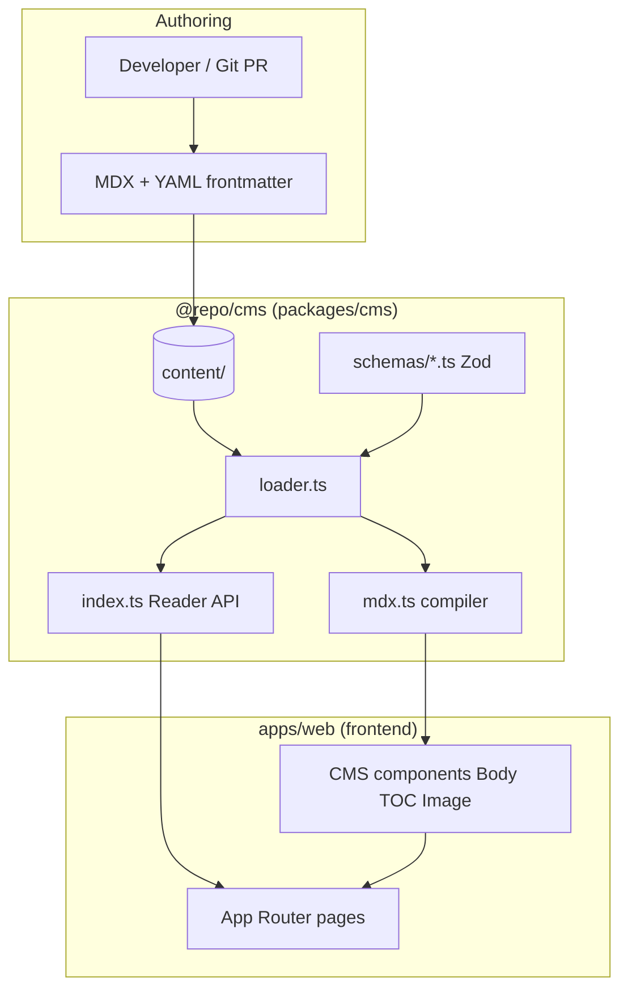
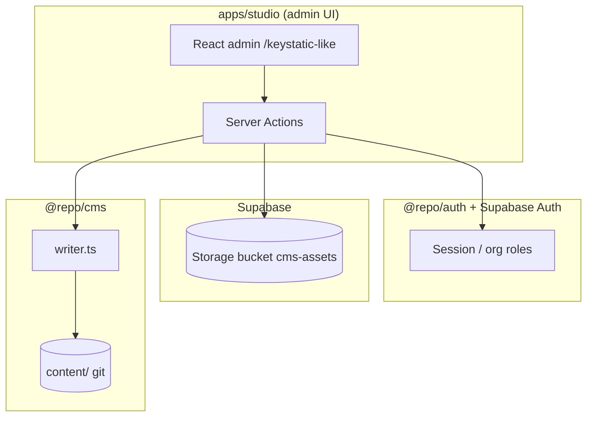

# XForge Lightweight CMS — Architecture & Requirements

**Version:** 0.1  
**Status:** Phase 1 accepted (2026-06-15)  
**Benchmark reference:** [Keystatic](https://keystatic.com/) (MIT, Thinkmill)  
**Monorepo package:** `@repo/cms`  
**Last updated:** 2026-06-15

---

## 1. Purpose

XForge CMS is an **in-repo, lightweight content system** for marketing surfaces (`apps/web`): blog, legal pages, and future collections. It replaces proprietary headless CMS dependencies (BaseHub) with **git as source of truth**, **Zod-validated schemas**, and a **stable TypeScript Reader API** for Next.js App Router.

Design goal: copy the **best ideas** from git-native OSS CMS products (especially Keystatic) without importing their runtime, cloud lock-in, or full admin surface until needed.

---

## 2. Benchmark: Keystatic

Keystatic was chosen as the single reference OSS CMS because it matches our target profile:

| Attribute | Keystatic | Relevance to XForge |
|-----------|-----------|---------------------|
| License | MIT | Same freedom to fork patterns |
| Storage | Git (MDX/YAML/JSON) | Same model we use |
| Database | None (Phase 1) | Same — no CMS DB required initially |
| Admin UI | Built-in (`/keystatic`) | We defer; plan optional `apps/studio` |
| Reader API | `createReader()` + collections | We mirror with `blog.getPost()` |
| Schema | `keystatic.config.ts` fields API | We use Zod per collection |
| Formats | Markdoc + MDX | We use MDX + frontmatter |
| GitHub mode | OAuth + commits via API | Planned Phase 2 |
| Cloud | Keystatic Cloud (optional) | We use Supabase only when needed |

**References:** [Keystatic docs](https://keystatic.com/docs), [Next.js installation](https://keystatic.com/docs/installation-next-js), [Reader API](https://keystatic.com/docs/reader-api).

---

## 3. Benchmark scorecard

Scoring: **0** missing, **1** partial, **2** meets need, **3** exceeds / better fit for XForge.

| Capability | Keystatic | XForge CMS (today) | XForge CMS (target) | Notes |
|------------|-----------|--------------------|---------------------|-------|
| Git-backed content | 2 | 2 | 2 | Parity |
| No runtime CMS token | 2 | 2 | 2 | Parity vs BaseHub |
| Typed Reader API | 2 | 2 | 3 | Zod + inferred types |
| Collection registry | 2 | 1 | 2 | Refactor loader → registry |
| Admin UI | 3 | 0 | 2 | Phase 2 `apps/studio` |
| Draft / publish | 1 | 0 | 2 | Frontmatter `status` |
| Image pipeline | 2 | 1 | 2 | Supabase Storage Phase 2 |
| i18n collections | 1 | 0 | 2 | `content/{locale}/` |
| GitHub write mode | 2 | 0 | 2 | Server actions + GitHub API |
| DB fallback | 0 | 0 | 1 | Optional Supabase Phase 3 |
| Monorepo isolation | 1 | 3 | 3 | Dedicated `@repo/cms` package |
| Zero extra deploy | 2 | 2 | 2 | Runs inside Next.js |
| MDX + code highlight | 2 | 2 | 2 | mdx-bundler + rehype-pretty-code |
| TOC + reading time | 1 | 2 | 2 | We compute locally |
| CI content validation | 1 | 1 | 3 | `cms:validate` script |
| Auth integration | 1 | 0 | 2 | Reuse `@repo/auth` in studio |

**Summary:** XForge CMS **matches Keystatic on storage and reader patterns**, **leads on monorepo packaging and compile-time validation**, and **lags on admin UI and GitHub write mode** (planned Phase 2).

---

## 4. Goals and non-goals

### Goals

1. **Content lives in git** — reviewable, versioned, deployable with code.
2. **Stable consumer API** — apps import `@repo/cms`, never read `content/` directly.
3. **Schema-first** — invalid frontmatter fails in CI, not in production.
4. **Framework-native** — Server Components, MDX, Next.js static params.
5. **Progressive complexity** — file → admin UI → optional DB without breaking API.

### Non-goals (v1)

- Real-time collaborative editing
- GraphQL content API
- Multi-tenant CMS SaaS
- Replacing Supabase for app data (orgs, users, pages)
- Full WYSIWYG page builder

---

## 5. Architecture requirements

### 5.1 Functional requirements

| ID | Requirement | Priority | Phase |
|----|-------------|----------|-------|
| FR-01 | Define content **collections** (blog, legal, …) | P0 | 1 ✅ |
| FR-02 | Read collection list and document by slug | P0 | 1 ✅ |
| FR-03 | Validate frontmatter with **Zod** | P0 | 1 ✅ |
| FR-04 | Compile MDX body + syntax highlighting | P0 | 1 ✅ |
| FR-05 | Generate TOC and reading time | P1 | 1 ✅ |
| FR-06 | Expose typed **Reader API** (`blog`, `legal`) | P0 | 1 ✅ |
| FR-07 | Support **draft** vs **published** filtering | P1 | 1.5 |
| FR-08 | Generic **collection registry** (no duplicated loaders) | P1 | 1.5 |
| FR-09 | **Admin UI** for non-developers | P2 | 2 |
| FR-10 | **Image upload** to Supabase Storage | P2 | 2 |
| FR-11 | **GitHub commit mode** for production edits | P2 | 2 |
| FR-12 | **Locale**-scoped collections | P2 | 2 |
| FR-13 | Optional **Postgres mirror** for search/analytics | P3 | 3 |
| FR-14 | Webhook on publish (Svix / internal) | P3 | 3 |

### 5.2 Non-functional requirements

| ID | Requirement | Target |
|----|-------------|--------|
| NFR-01 | No external CMS API at runtime (Phase 1) | 100% file reads |
| NFR-02 | Typecheck consumer apps without CMS secrets | No env vars required |
| NFR-03 | Cold read latency (single post) | < 50ms dev, cached prod |
| NFR-04 | CI validates all MDX files | `pnpm cms:validate` in < 10s |
| NFR-05 | Package boundary | Only `@repo/cms` touches `content/` |
| NFR-06 | Security (admin) | `@repo/auth` + org role `editor` |
| NFR-07 | License | MIT-compatible deps only |

---

## 6. Full-stack architecture

### 6.1 Phase 1 — Git reader (current)



**Database:** None for CMS content.  
**Backend:** Node.js file I/O inside Next.js Server Components / RSC.  
**Frontend:** `apps/web` marketing site.  
**UI:** Public pages only; no admin.

### 6.2 Phase 2 — Studio + assets



**Database:** Supabase Storage for images; content still in git.  
**Backend:** Next.js Server Actions in `apps/studio` or route `apps/web/app/admin/cms`.  
**Frontend:** Admin UI (shadcn from `@repo/design-system`).  
**Optional:** GitHub App commits on save (Keystatic GitHub mode equivalent).

### 6.3 Phase 3 — Optional DB mirror (search / workflows)

```mermaid
flowchart LR
  GIT[(git content/)] --> SYNC[sync job / webhook]
  SYNC --> PG[(Supabase Postgres next_forge.cms_documents)]
  PG --> SEARCH[FTS / API]
  READER[@repo/cms Reader API] --> GIT
  READER -.->|fallback| PG
```

Use only when git-only search or approval workflows become insufficient.

---

## 7. Technology stack

| Layer | Phase 1 (now) | Phase 2 | Phase 3 |
|-------|-----------------|---------|---------|
| **Frontend (public)** | Next.js 16 App Router (`apps/web`) | Same | Same |
| **Frontend (admin)** | — | Next.js (`apps/studio`) | Same |
| **UI components** | `@repo/design-system` | Same + form builders | Same |
| **CMS core** | `@repo/cms` TypeScript | + `writer`, `collections` | + `sync` |
| **Validation** | Zod 4 | Same | Same |
| **MDX** | mdx-bundler, rehype-slug, rehype-pretty-code | Same | Same |
| **Parsing** | gray-matter | Same | Same |
| **Backend runtime** | Next.js Server Components / RSC | + Server Actions | + Edge cron |
| **Auth** | — | Supabase Auth (`@repo/auth`) | Same |
| **Database** | None | Supabase Storage (assets) | Postgres `cms_*` tables |
| **Cache** | Next.js `cache()` / build-time SSG | Same | + Redis optional |
| **CI** | turbo typecheck | + `cms:validate` | + sync checks |

---

## 8. Data model

### 8.1 File layout (source of truth)

```yaml
# content/blog/{slug}.mdx
---
title: string          # required
description: string    # required
date: ISO-8601         # required
status: published      # draft | published (Phase 1.5)
image:                 # optional
  url: string
  width: number
  height: number
  alt: string | null
authors:               # optional
  - name: string
    xUrl: string
categories:            # optional
  - name: string
---

MDX body...
```

```yaml
# content/legal/{slug}.mdx
---
title: string
description: string
status: published
---
```

### 8.2 TypeScript contracts (Reader API)

```typescript
// Discriminated document kinds
type ContentBody = {
  plainText: string;
  readingTime: number;
  code: string;      // compiled MDX
  toc: TocItem[];
};

type PostMeta = {
  _slug: string;
  _title: string;
  date: string;
  description: string;
  image: ContentImage;
  authors: ContentAuthor[];
  categories: ContentCategory[];
};

type Post = PostMeta & { body: ContentBody };
```

Public surface (stable):

```typescript
blog.getPosts(): Promise<PostMeta[]>
blog.getPost(slug): Promise<Post | null>
blog.getLatestPost(): Promise<Post | null>

legal.getPostsMeta(): Promise<LegalPostMeta[]>
legal.getPost(slug): Promise<LegalPost | null>
```

### 8.3 Phase 3 Postgres schema (optional)

```sql
-- schema: next_forge
CREATE TABLE cms_documents (
  id            text PRIMARY KEY,
  collection    text NOT NULL,  -- 'blog' | 'legal'
  slug          text NOT NULL,
  locale        text NOT NULL DEFAULT 'en',
  title         text NOT NULL,
  description   text,
  status        text NOT NULL DEFAULT 'draft',
  frontmatter   jsonb NOT NULL DEFAULT '{}',
  body_mdx      text NOT NULL,
  published_at  timestamptz,
  created_at    timestamptz NOT NULL DEFAULT now(),
  updated_at    timestamptz NOT NULL DEFAULT now(),
  UNIQUE (collection, slug, locale)
);

CREATE INDEX cms_documents_collection_status_idx
  ON cms_documents (collection, status);
```

---

## 9. Feature roadmap

### Phase 1 — Reader (✅ shipped)

- [x] Git MDX content directories
- [x] Zod frontmatter validation
- [x] MDX compile pipeline
- [x] TOC + reading time
- [x] Reader API (`blog`, `legal`)
- [x] Render components (`Body`, `TableOfContents`, `Image`)
- [x] `apps/web` integration (blog, legal, sitemap, footer, hero)

### Phase 1.5 — Engine hardening

- [ ] `collections.ts` registry (remove blog/legal loader duplication)
- [ ] `status: draft | published` + filter in list endpoints
- [ ] `cache.ts` — memoize compile by content hash
- [ ] `scripts/validate-content.mjs` — CI gate
- [ ] `cms:validate` npm script

### Phase 2 — Studio (Keystatic parity target)

- [ ] `apps/studio` or `/admin/cms` routes
- [ ] Collection browser + MDX editor (CodeMirror / MDXEditor)
- [ ] Supabase Storage uploads → frontmatter URL
- [ ] Auth: `@repo/auth` requireOrg + editor role
- [ ] GitHub commit on publish (optional)
- [ ] Preview URL (`?preview=draft`)

### Phase 3 — Scale (only if needed)

- [ ] Postgres mirror + FTS search
- [ ] Publish webhooks via `@repo/webhooks`
- [ ] i18n collections (`content/blog/en/`, `content/blog/ja/`)
- [ ] Audit log table

---

## 10. Directory trees

### 10.1 Current — `packages/cms`

```text
packages/cms/
├── README.md
├── docs/
│   └── ARCHITECTURE.md          # this document
├── package.json
├── tsconfig.json
├── .gitignore
│
├── index.ts                     # public Reader API exports
├── types.ts                     # Post, LegalPost, ContentBody, …
├── schemas.ts                   # Zod frontmatter (→ schemas/ in 1.5)
├── loader.ts                    # file read + map (→ loader/ in 1.5)
├── mdx.ts                       # compile, TOC, reading time
│
├── content/                     # SOURCE OF TRUTH (git)
│   ├── blog/
│   │   └── welcome-to-xforge.mdx
│   └── legal/
│       ├── privacy.mdx
│       └── terms.mdx
│
└── components/                  # presentation helpers for consumers
    ├── body.tsx                 # client MDX renderer
    ├── toc.tsx
    └── image.tsx                # next/image wrapper
```

### 10.2 Target — `packages/cms` (Phase 1.5–2)

```text
packages/cms/
├── docs/
│   └── ARCHITECTURE.md
├── index.ts
├── types.ts
│
├── collections/
│   ├── index.ts                 # registry + types inferred from config
│   ├── blog.config.ts
│   └── legal.config.ts
│
├── schemas/
│   ├── blog.schema.ts
│   ├── legal.schema.ts
│   └── shared.schema.ts           # image, author, status enum
│
├── loader/
│   ├── read-collection.ts         # generic list/get
│   ├── read-document.ts
│   └── paths.ts                   # content root resolution
│
├── compiler/
│   ├── mdx.ts
│   ├── toc.ts
│   └── cache.ts                   # unstable_cache wrapper
│
├── writer/                        # Phase 2
│   ├── save-document.ts           # server-only
│   └── github-commit.ts
│
├── scripts/
│   └── validate-content.mjs       # CI: load all MDX + Zod parse
│
├── content/
│   ├── blog/
│   └── legal/
│
└── components/
    ├── body.tsx
    ├── toc.tsx
    └── image.tsx
```

### 10.3 Consumer — `apps/web` (frontend, public)

```text
apps/web/
├── app/
│   └── [locale]/
│       ├── blog/
│       │   ├── page.tsx           # blog.getPosts()
│       │   └── [slug]/page.tsx    # blog.getPost(slug)
│       ├── legal/
│       │   └── [slug]/page.tsx    # legal.getPost(slug)
│       └── (home)/
│           └── components/
│               └── hero.tsx       # blog.getLatestPost()
├── components/
│   └── sidebar.tsx                # TOC sidebar
└── public/
    └── blog/
        └── placeholder.svg        # static assets referenced in frontmatter
```

### 10.4 Admin — `apps/studio` (Phase 2, planned)

```text
apps/studio/                       # NEW APP — port 3003
├── app/
│   ├── layout.tsx
│   ├── (auth)/
│   │   └── sign-in/               # redirect to apps/app or shared auth
│   └── (cms)/
│       ├── layout.tsx               # sidebar nav
│       ├── page.tsx                 # dashboard
│       ├── [collection]/
│       │   ├── page.tsx             # document list
│       │   ├── new/page.tsx
│       │   └── [slug]/
│       │       ├── page.tsx         # editor
│       │       └── preview/page.tsx
│       └── api/
│           ├── upload/route.ts      # → Supabase Storage
│           └── publish/route.ts     # → writer.save + optional GitHub
├── actions/
│   ├── documents.ts               # Server Actions
│   └── media.ts
├── components/
│   ├── document-list.tsx
│   ├── mdx-editor.tsx
│   └── frontmatter-form.tsx       # generated from Zod schema
└── env.ts
```

### 10.5 Database & storage (Phase 2–3)

```text
Supabase (project icfqhigdbkzpfimxvdnl)
├── Storage
│   └── bucket: cms-assets
│       └── blog/{uuid}.{ext}
│
└── Postgres (schema next_forge)     # Phase 3 optional
    ├── cms_documents
    └── cms_revisions
```

**Note:** App data (users, orgs, pages) stays in existing `next_forge` tables managed by Drizzle. CMS tables are **additive** and optional.

### 10.6 Monorepo context

```text
afenda-Xforge/
├── apps/
│   ├── app/                       # product app (:3000)
│   ├── web/                       # marketing site (:3001) — CMS consumer
│   ├── api/                       # API (:3002)
│   └── studio/                    # CMS admin (:3003) — Phase 2
├── packages/
│   ├── cms/                       # THIS PACKAGE
│   ├── auth/                      # Supabase auth (studio guard)
│   ├── database/                  # Drizzle (optional cms_* migrations)
│   └── design-system/             # UI for studio + web
└── turbo.json
```

---

## 11. API boundaries

| Layer | May import | Must not |
|-------|------------|----------|
| `apps/web` | `@repo/cms`, `@repo/cms/components/*` | Read `packages/cms/content` directly |
| `apps/studio` | `@repo/cms`, `@repo/cms/writer` | Bypass Zod validation |
| `@repo/cms` | Node fs, mdx-bundler, zod | `@repo/auth`, UI routes |
| `@repo/database` | Drizzle | CMS presentation logic |

---

## 12. Comparison decision: build vs adopt Keystatic

| Option | When to choose |
|--------|----------------|
| **Keep building XForge CMS** | Full control, monorepo types, Supabase integration, no Keystatic Cloud |
| **Adopt Keystatic wholesale** | Need admin UI immediately, accept Markdoc/config API |
| **Hybrid** | Keystatic admin UI + XForge Reader wrapper (not recommended — two schemas) |

**Decision:** Continue **XForge CMS** with Keystatic as **benchmark only**. Re-evaluate after Phase 2 if admin cost exceeds 2 weeks.

---

## 13. Success metrics

| Metric | Phase 1 | Phase 2 |
|--------|---------|---------|
| External CMS tokens | 0 | 0 |
| `apps/web` dev without secrets | Yes | Yes |
| Time to add new collection | < 1 h | < 30 min (registry) |
| Non-dev can publish blog post | No (git) | Yes (studio) |
| CI catches bad frontmatter | Manual | Automated |

---

## 14. References

- [Keystatic](https://keystatic.com/) — MIT git-backed CMS benchmark
- [Keystatic Reader API](https://keystatic.com/docs/reader-api)
- [mdx-bundler](https://github.com/kentcdodds/mdx-bundler)
- XForge monorepo: `packages/cms`, `apps/web`

---

## Appendix A — Keystatic feature mapping

| Keystatic concept | XForge equivalent |
|-------------------|-------------------|
| `keystatic.config.ts` | `collections/*.config.ts` + Zod |
| `collections.posts` | `content/blog/` + `blog` Reader |
| `singletons` | `content/settings.json` (future) |
| `createReader()` | `blog.getPost()` / loader |
| `fields.markdoc()` | MDX + mdx-bundler |
| `storage: local` | `content/` git |
| `storage: github` | `writer/github-commit.ts` |
| Admin `/keystatic` | `apps/studio` |

## Appendix B — Content validation script (planned)

```bash
pnpm --filter @repo/cms validate
# Loads every MDX under content/, runs Zod parse, exits non-zero on failure
```

## Appendix C — Adding a new collection (target)

1. Add `schemas/changelog.schema.ts`
2. Add `collections/changelog.config.ts`
3. Create `content/changelog/*.mdx`
4. Export `changelog` from `index.ts`
5. Add route in `apps/web/app/[locale]/changelog/`
6. Run `pnpm cms:validate`
